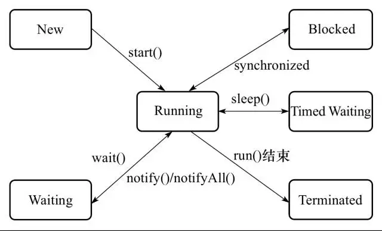
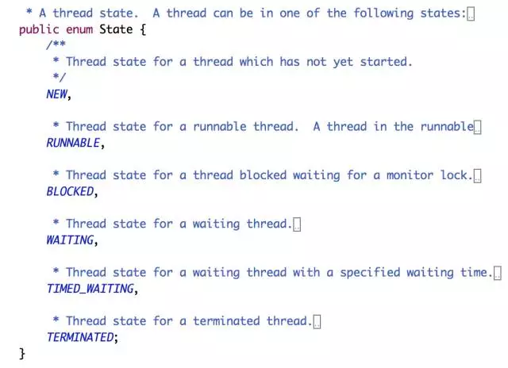

上图是一个线程的生命周期状态流转图，很清楚的描绘了一个线程从创建到终止的过程。

这些状态的枚举值都定义在java.lang.Thread.State下

NEW：毫无疑问表示的是刚创建的线程，还没有开始启动。

RUNNABLE:  表示线程已经触发start()方式调用，线程正式启动，线程处于运行中状态。

BLOCKED：表示线程阻塞，等待获取锁，如碰到synchronized、lock等关键字等占用临界区的情况，一旦获取到锁就进行RUNNABLE状态继续运行。

WAITING：表示线程处于无限制等待状态，等待一个特殊的事件来重新唤醒，如通过wait()方法进行等待的线程等待一个notify()或者notifyAll()方法，通过join()方法进行等待的线程等待目标线程运行结束而唤醒，一旦通过相关事件唤醒线程，线程就进入了RUNNABLE状态继续运行。

TIMED_WAITING：表示线程进入了一个有时限的等待，如sleep(3000)，等待3秒后线程重新进行RUNNABLE状态继续运行。

TERMINATED：表示线程执行完毕后，进行终止状态。

需要注意的是，一旦线程通过start方法启动后就再也不能回到初始NEW状态，线程终止后也不能再回到RUNNABLE状态。