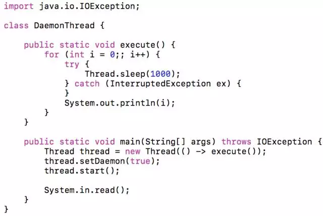
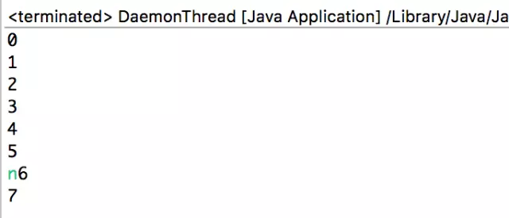

> **定义**

什么是守护线程？与守护线程相对应的就是用户线程，守护线程就是守护用户线程，当用户线程全部执行完结束之后，守护线程才会跟着结束。也就是守护线程必须伴随着用户线程，如果一个应用内只存在一个守护线程，没有用户线程，守护线程自然会退出。

> **应用**

下面是守护线程的一个简单应用

创建一个简单的线程，把一个线程设置daemon为true即表示设置为守护线程，这里主线程是用户线程阻塞用户任何一个系统输入后退出，守护线程守护的是主线程，守护线程每隔一秒打印i的值，直到主线程输入任何一个字符退出，主线程退出了守护线程也就会跟就退出不再打印。

运行上面的程序，随便输入一个字符：n，守护线程就退出了，程序停止打印。

> **注意**

setDaemon方法必须设置在线程start方法启动之前，不然会抛出异常。