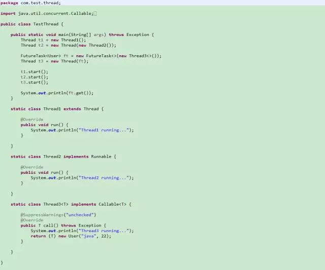

> **实现多线程的3种方式**

1、继承Thread类

看jdk源码可以发现，Thread类其实是实现了Runnable接口的一个实例，继承Thread类后需要重写run方法并通过start方法启动线程。

继承Thread类耦合性太强了，因为java只能单继承，所以不利于扩展。

2、实现Runnable接口

通过实现Runnable接口并重写run方法，并把Runnable实例传给Thread对象，Thread的start方法调用run方法再通过调用Runnable实例的run方法启动线程。

所以如果一个类继承了另外一个父类，此时要实现多线程就不能通过继承Thread的类实现。

3、实现Callable接口

通过实现Callable接口并重写call方法，并把Callable实例传给FutureTask对象，再把FutureTask对象传给Thread对象。它与Thread、Runnable最大的不同是Callable能返回一个异步处理的结果Future对象并能抛出异常，而其他两种不能。

> **示例代码**

结果输出：

Thread1 running...

Thread2 running...

Thread3 running...

name:java,age:22

