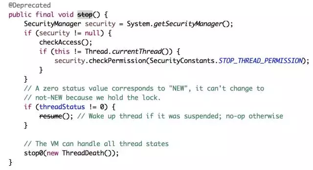
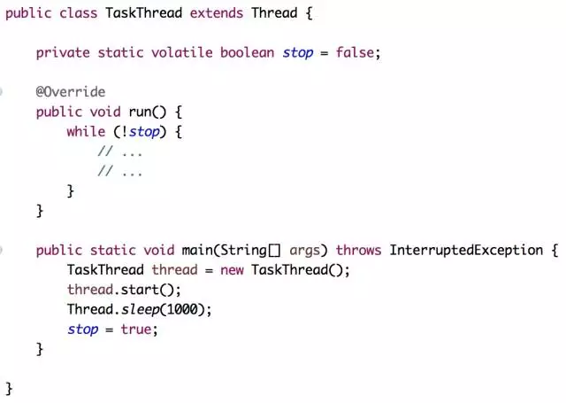

我们的系统肯定有些线程为了保证业务需要是要常驻后台的，一般它们不会自己终止，需要我们通过手动来终止它们。我们知道启动一个线程是start方法，自然有一个对应的终止线程的stop方法，通过stop方法可以很快速、方便地终止一个线程，我们来看看stop的源代码。

通过注解@Deprecated看出stop方法被标为废弃的方法，jdk在以后的版本中可能被移除，不建议大家使用这种API。

那为什么这么好的一个方法怎么不推荐使用，还要标注为废弃呢？

假设有这样的一个业务场景，一个线程正在处理一个复杂的业务流程，突然间线程被调用stop而意外终止，这个业务数据还有可能是一致的吗？这样是肯定会出问题的，stop会释放锁并强制终止线程，造成执行一半的线程终止，带来的后果也是可想而知的，这就是为什么jdk不推荐使用stop终止线程的方法的原因，因为它很暴力会带来数据不一致性的问题。

正因为stop方法太过暴力，所以一般不推荐使用，除非你非常清楚你自己的业务场景，用stop终止不会给你的业务带来影响。

说了这么多，那如何优雅地终止一个线程呢？看看下面的程序。

其实也不难，只需要添加一个变量，判断这个变量在某个值的时候就退出循环，这时候每个循环为一个整合不被强行终止就不会影响单个业务的执行结果。