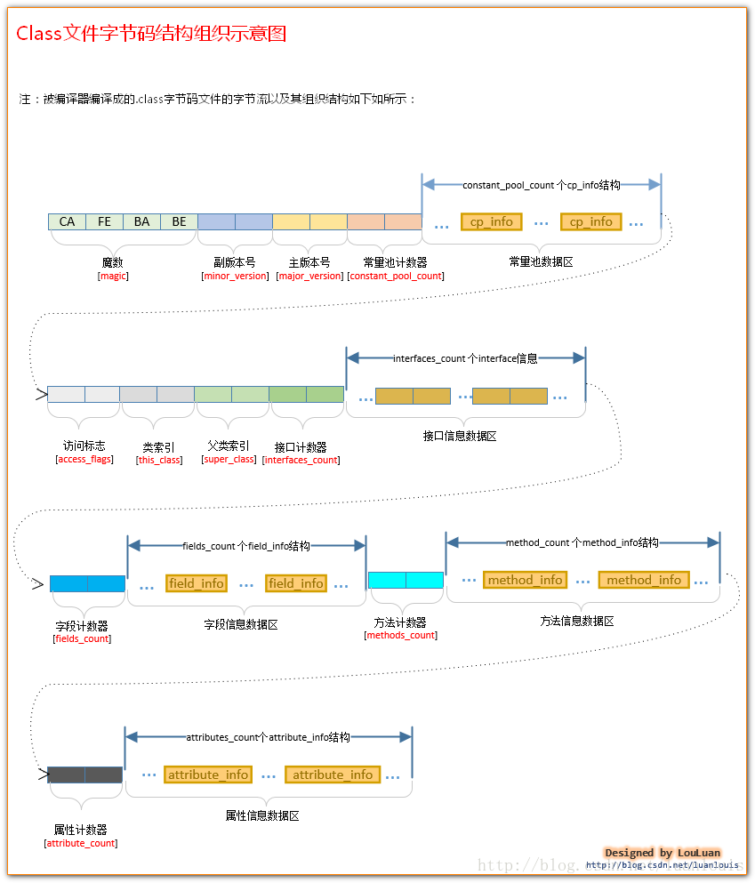
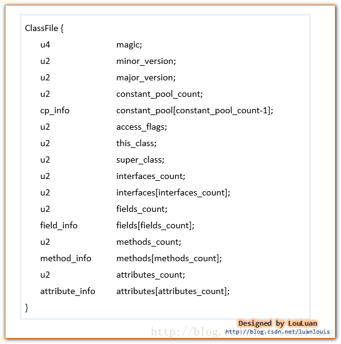

# Class

##  Class文件结构

作为Java程序猿，我们知道，我们写好的.java 源代码，最后会被Java编译器编译成后缀为.class的文件，该类型的文件是由字节组成的文件，又叫字节码文件。那么，class字节码文件里面到底是有什么呢？它又是怎样组织的呢？让我们先来大概了解一下他的组成结构吧。



## Class 文件基本结构

### NO1. 魔数(magic)

-   所有的由Java编译器编译而成的class文件的前4个字节都是“0xCAFEBABE”  
    它的作用在于：当JVM在尝试加载某个文件到内存中来的时候，会首先判断此class文件有没有JVM认为可以接受的“签名”，即JVM会首先读取文件的前4个字节，判断该4个字节是否是“0xCAFEBABE”，如果是，则JVM会认为可以将此文件当作class文件来加载并使用。


### NO2.版本号(minor_version,major_version)

-   随着Java本身的发展，Java语言特性和JVM虚拟机也会有相应的更新和增强。目前我们能够用到的JDK版本如：1.5，1.6，1.7，还有现如今最新的1.8。发布新版本的目的在于：在原有的版本上增加新特性和相应的JVM虚拟机的优化。而随着主版本发布的次版本，则是修改相应主版本上出现的bug。我们平时只需要关注主版本就可以了。

- 主版本号和次版本号在class文件中各占两个字节，副版本号占用第5、6两个字节，而主版本号则占用第7，8两个字节。JDK1.0的主版本号为45，以后的每个新主版本都会在原先版本的基础上加1。若现在使用的是JDK1.7编译出来的class文件，则相应的主版本号应该是51,对应的7，8个字节的十六进制的值应该是 0x33。

- 一个 JVM实例只能支持特定范围内的主版本号 （Mi 至Mj） 和 0 至特定范围内 （0 至 m） 的副版本号。假设一个 Class 文件的格式版本号为 V， 仅当Mi.0 ≤ v ≤ Mj.m成立时，这个 Class 文件才可以被此 Java 虚拟机支持。不同版本的 Java 虚拟机实现支持的版本号也不同，高版本号的 Java 虚拟机实现可以支持低版本号的 Class 文件，反之则不成立。

- JVM在加载class文件的时候，会读取出主版本号，然后比较这个class文件的主版本号和JVM本身的版本号，如果JVM本身的版本号 < class文件的版本号，JVM会认为加载不了这个class文件，会抛出我们经常见到的"java.lang.UnsupportedClassVersionError: Bad version number in .class file " Error 错误；反之，JVM会认为可以加载此class文件，继续加载此class文件。

```note
1. 有时候我们在运行程序时会抛出这个Error 错误："java.lang.UnsupportedClassVersionError: Bad version number in .class file"。上面已经揭示了出现这个问题的原因，就是在于当前尝试加载class文件的JVM虚拟机的版本 低于class文件的版本。解决方法：1.重新使用当前jvm编译源代码，然后再运行代码；2.将当前JVM虚拟机更新到class文件的版本。
2. 怎样查看class文件的版本号？

 可以借助于文本编辑工具，直接查看该文件的7，8个字节的值，确定class文件是什么版本的。

当然快捷的方式使用JDK自带的javap工具，如当前有Programmer.class 文件，进入此文件所在的目录，然后执行 ”javap -v Programmer“,结果会类似如下所示：

```


### NO3.常量池计数器(constant_pool_count)

-  常量池是class文件中非常重要的结构，它描述着整个class文件的字面量信息。 `常量池是由一组constant_pool结构体数组组成的，而数组的大小则由常量池计数器指定`。
-  常量池计数器constant_pool_count 的值 =constant_pool表中的成员数+ 1。constant_pool表的索引值只有在大于 0 且小于constant_pool_count时才会被认为是有效的。

### NO4.常量池数据区(constant_pool[contstant_pool_count-1])

- `常量池，constant_pool是一种表结构`,它包含 Class 文件结构及其子结构中引用的所有
  - 字符串常量、 
  - 类或接口名、
  - 字段名
  - 和其它常量。 
- 常量池中的每一项都具备相同的格式特征——第一个字节作为类型标记用于识别该项是`哪种类型`的常量，称为 “tag byte” 。常量池的索引范围是 1 至constant_pool_count−1。常量池的具体细节我们会稍后讨论。


### NO5.访问标志(access_flags)

-  访问标志，access_flags 是一种掩码标志，用于表示某个类或者接口的访问权限及基础属性。

 
### NO6.类索引(this_class)

- 类索引，this_class的值必须是对constant_pool表中项目的一个有效索引值。constant_pool表在这个索引处的项必须为CONSTANT_Class_info 类型常量，表示这个 Class 文件所定义的类或接口。

### NO7.父类索引(super_class)

- ​     父类索引，对于类来说，super_class 的值必须为 0 或者是对constant_pool 表中项目的一个有效索引值。如果它的值不为 0，那 constant_pool 表在这个索引处的项必须为CONSTANT_Class_info 类型常量，表示这个 Class 文件所定义的类的直接父类。当前类的直接父类，以及它所有间接父类的access_flag 中都不能带有ACC_FINAL 标记。对于接口来说，它的Class文件的super_class项的值必须是对constant_pool表中项目的一个有效索引值。constant_pool表在这个索引处的项必须为代表 java.lang.Object 的 CONSTANT_Class_info 类型常量 。如果 Class 文件的 super_class的值为 0，那这个Class文件只可能是定义的是java.lang.Object类，只有它是唯一没有父类的类。


### NO8.接口计数器(interfaces_count)

-  接口计数器，interfaces_count的值表示当前类或接口的直接父接口数量。


### NO9.接口信息数据区(interfaces[interfaces_count])

-   接口表，interfaces[]数组中的每个成员的值必须是一个对constant_pool表中项目的一个有效索引值， 它的长度为 interfaces_count。每个成员 interfaces[i]  必须为 CONSTANT_Class_info类型常量，其中 0 ≤ i <interfaces_count。在interfaces[]数组中，成员所表示的接口顺序和对应的源代码中给定的接口顺序（从左至右）一样，即interfaces[0]对应的是源代码中最左边的接口。


### NO10.字段计数器(fields_count)

-   字段计数器，fields_count的值表示当前 Class 文件 fields[]数组的成员个数。 fields[]数组中每一项都是一个field_info结构的数据项，它用于表示该类或接口声明的类字段或者实例字段。


### NO11.字段信息数据区(fields[fields_count])

-   字段表，fields[]数组中的每个成员都必须是一个fields_info结构的数据项，用于表示当前类或接口中某个字段的完整描述。 fields[]数组描述当前类或接口声明的所有字段，但不包括从父类或父接口继承的部分。


### NO12.方法计数器(methods_count)

- ​     方法计数器， methods_count的值表示当前Class 文件 methods[]数组的成员个数。Methods[]数组中每一项都是一个 method_info 结构的数据项。

### NO13.方法信息数据区(methods[methods_count])

-   方法表，methods[] 数组中的每个成员都必须是一个 method_info 结构的数据项，用于表示当前类或接口中某个方法的完整描述。如果某个method_info 结构的access_flags 项既没有设置 ACC_NATIVE 标志也没有设置ACC_ABSTRACT 标志，那么它所对应的方法体就应当可以被 Java 虚拟机直接从当前类加载，而不需要引用其它类。 method_info结构可以表示类和接口中定义的所有方法，包括实例方法、类方法、实例初始化方法方法和类或接口初始化方法方法 。methods[]数组只描述当前类或接口中声明的方法，不包括从父类或父接口继承的方法。


### NO14.属性计数器(attributes_count)

- ​     属性计数器，attributes_count的值表示当前 Class 文件attributes表的成员个数。attributes表中每一项都是一个attribute_info 结构的数据项。

### NO15.属性信息数据区(attributes[attributes_count])

- ​     属性表，attributes 表的每个项的值必须是attribute_info结构。

- 在Java 7 规范里，Class文件结构中的attributes表的项包括下列定义的属性：

  -  InnerClasses  、
  -  EnclosingMethod 、 
  - Synthetic  、
  - Signature、
  - SourceFile，
  - SourceDebugExtension 、
  - Deprecated、
  - RuntimeVisibleAnnotations 、
  - RuntimeInvisibleAnnotations以及
  - BootstrapMethods属性。
- 对于支持 Class 文件格式版本号为 49.0 或更高的 Java 虚拟机实现，必须正确识别并读取attributes表中的Signature、RuntimeVisibleAnnotations和RuntimeInvisibleAnnotations属性。对于支持Class文件格式版本号为 51.0 或更高的 Java 虚拟机实现，必须正确识别并读取 attributes表中的BootstrapMethods属性。Java 7 规范 要求任一 Java 虚拟机实现可以自动忽略 Class 文件的 attributes表中的若干 （甚至全部） 它不可识别的属性项。任何本规范未定义的属性不能影响Class文件的语义，只能提供附加的描述信息 。


​      


根据上述的叙述，我们可以将class的文件组织结构概括成以下面这个结构体：




参考书目：

Java虚拟机规范（Java SE 7）中文版（Java_Virtual_Machine_Specification_Java_SE_7）

[深入理解Java虚拟机：JVM高级特性与最佳实践].周志明


作者的话
​    本文是《Java虚拟机原理图解》的第一篇，如果您有兴趣，请关注该系列的其他文章～

   觉得本文不错，顺手点个赞哦～～您的鼓励，是我继续分享知识的强大动力！


---------------------
作者：亦山 
来源：CSDN 
原文：https://blog.csdn.net/luanlouis/article/details/39892027 
版权声明：本文为博主原创文章，转载请附上博文链接！