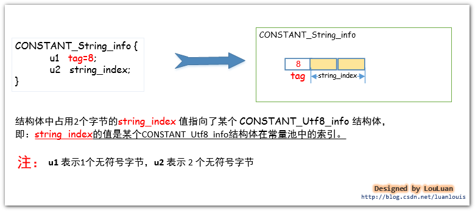
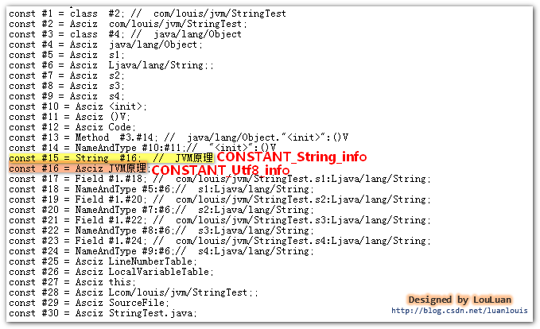
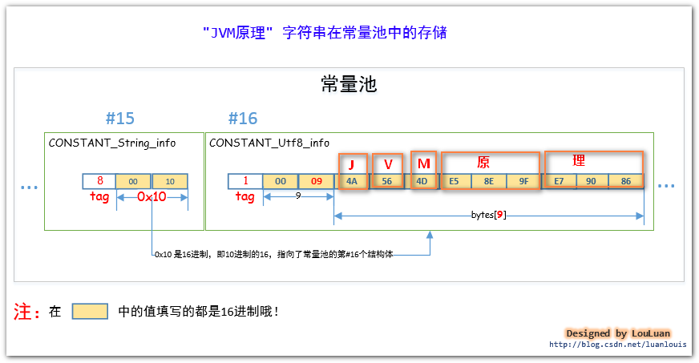

# Class文件中的常量池

## NO1.常量池在class文件的什么位置？
 我的上一篇文章《Java虚拟机原理图解》 1、class文件基本组织结构中已经提到了class的文件结构，在class文件中的魔数、副版本号、主版本之后，紧接着就是常量池的数据区域了，如下图用红线包括的位置：

  ！

知道了常量池的位置后，然后让我们来揭秘常量池里究竟有什么东西吧～     

## NO2.常量池的里面是怎么组织的？
​      常量池的组织很简单，前端的两个字节占有的位置叫做常量池计数器(constant_pool_count)，它记录着常量池的组成元素  常量池项(cp_info) 的个数。紧接着会排列着constant_pool_count-1个常量池项(cp_info)。如下图所示：

   

 

## NO3.常量池项 (cp_info) 的结构是什么？
   每个常量池项(cp_info) 都会对应记录着class文件中的某中类型的字面量。让我们先来了解一下常量池项(cp_info)的结构吧：

​    

     JVM虚拟机规定了不同的tag值和不同类型的字面量对应关系如下：


​    

所以根据cp_info中的tag 不同的值，可以将cp_info 更细化为以下结构体：

 - CONSTANT_Utf8_info,
 - CONSTANT_Integer_info,
 - CONSTANT_Float_info,
 - CONSTANT_Long_info,

 - CONSTANT_Double_info,
 - CONSTANT_Class_info,
 - CONSTANT_String_info,
 - CONSTANT_Fieldref_info,

 - CONSTANT_Methodref_info,
 - CONSTANT_InterfaceMethodref_info,
 - CONSTANT_NameAndType_info,
 - CONSTANT_MethodHandle_info,

 - CONSTANT_MethodType_info,
 - CONSTANT_InvokeDynamic_info。


​           

             现在让我们看一下细化了的常量池的结构会是类似下图所示的样子：


​                
​          

## NO4.常量池能够表示那些信息？


### NO5. int和float数据类型的常量在常量池中是怎样表示和存储的？

> (CONSTANT_Integer_info, CONSTANT_Float_info)

 Java语言规范规定了 int类型和Float 类型的数据类型占用 4 个字节的空间。那么存在于class字节码文件中的该类型的常量是如何存储的呢？相应地，在常量池中，将 int和Float类型的常量分别使用CONSTANT_Integer_info和 Constant_float_info表示，他们的结构如下所示：


举例：建下面的类 IntAndFloatTest.java，在这个类中，我们声明了五个变量，但是取值就两种int类型的10 和Float类型的11f。


```java
package com.louis.jvm;

public class IntAndFloatTest {
	private final int a = 10;
	private final int b = 10;
	private float c = 11f;
	private float d = 11f;
	private float e = 11f;
}
```


然后用编译器编译成IntAndFloatTest.class字节码文件，我们通过javap -v IntAndFloatTest 指令来看一下其常量池中的信息，可以看到 *虽然我们在代码中写了两次10 和三次11f，但是常量池中，就只有一个常量10 和一个常量11f* ,如下图所示:


从结果上可以看到常量池第#8 个常量池项(cp_info) 就是CONSTANT_Integer_info,值为10；第#23个常量池项(cp_info) 就是CONSTANT_Float_info,值为11f。(常量池中其他的东西先别纠结啦，我们会面会一一讲解的哦)。

 代码中所有用到 int 类型 10 的地方，会使用指向常量池的 指针值#8 定位到第#8 个常量池项(cp_info)，即值为 10的结构体 CONSTANT_Integer_info，而用到float类型的11f时，也会指向常量池的指针值#23来定位到第#23个常量池项(cp_info) 即值为11f的结构体CONSTANT_Float_info。如下图所示：


 

### NO6. long和 double数据类型的常量在常量池中是怎样表示和存储的？

>(CONSTANT_Long_info、CONSTANT_Double_info )

Java语言规范规定了 long 类型和 double类型的数据类型占用8 个字节的空间。那么存在于class 字节码文件中的该类型的常量是如何存储的呢？相应地，在常量池中，将long和double类型的常量分别使用CONSTANT_Long_info和Constant_Double_info表示，他们的结构如下所示：


     举例：建下面的类 LongAndDoubleTest.java，在这个类中，我们声明了六个变量，但是取值就两种Long 类型的-6076574518398440533L 和Double 类型的10.1234567890D。

```java
package com.louis.jvm;

public class LongAndDoubleTest {
	
	private long a = -6076574518398440533L;
	private long b = -6076574518398440533L;
	private long c = -6076574518398440533L;
	private double d = 10.1234567890D;
	private double e = 10.1234567890D;
	private double f = 10.1234567890D;
}

```

然后用编译器编译成 LongAndDoubleTest.class 字节码文件，我们通过javap -v LongAndDoubleTest指令来看一下其常量池中的信息，可以看到虽然我们在代码中写了三次-6076574518398440533L 和三次10.1234567890D，但是常量池中，就只有一个常量-6076574518398440533L 和一个常量10.1234567890D,如下图所示:


从结果上可以看到常量池第 #18 个常量池项(cp_info) 就是CONSTANT_Long_info,值为-6076574518398440533L ；第 #26个常量池项(cp_info) 就是CONSTANT_Double_info,值为10.1234567890D。(常量池中其他的东西先别纠结啦，我们会面会一一讲解的哦)。
​    
代码中所有用到 long 类型-6076574518398440533L 的地方，会使用指向常量池的指针值#18 定位到第 #18 个常量池项(cp_info)，即值为-6076574518398440533L 的结构体CONSTANT_Long_info，而用到double类型的10.1234567890D时，也会指向常量池的指针值#26 来定位到第 #26 个常量池项(cp_info) 即值为10.1234567890D的结构体CONSTANT_Double_info。如下图所示：


 

### NO7. String类型的字符串常量在常量池中是怎样表示和存储的？
>(CONSTANT_String_info、CONSTANT_Utf8_info）

对于字符串而言，JVM会将字符串类型的字面量以UTF-8 编码格式存储到在class字节码文件中。这么说可能有点摸不着北，我们先从直观的Java源码中中出现的用双引号"" 括起来的字符串来看，在编译器编译的时候，都会将这些字符串转换成CONSTANT_String_info结构体，然后放置于常量池中。其结构如下所示：



如上图所示的结构体，CONSTANT_String_info结构体中的string_index的值指向了CONSTANT_Utf8_info结构体，而字符串的utf-8编码数据就在这个结构体之中。如下图所示：


请看一例，定义一个简单的StringTest.java类，然后在这个类里加一个"JVM原理" 字符串，然后，我们来看看它在class文件中是怎样组织的。


```java
package com.louis.jvm;

public class StringTest {
	private String s1 = "JVM原理";
	private String s2 = "JVM原理";
	private String s3 = "JVM原理";
	private String s4 = "JVM原理";
}
```
将Java源码编译成StringTest.class文件后，在此文件的目录下执行 javap -v StringTest 命令，会看到如下的常量池信息的轮廓：

 

 (PS :使用javap -v 指令能看到易于我们阅读的信息，查看真正的字节码文件可以使用HEXWin、NOTEPAD++、UtraEdit 等工具。)

在面的图中，我们可以看到CONSTANT_String_info结构体位于常量池的第#15个索引位置。而存放"Java虚拟机原理" 字符串的 UTF-8编码格式的字节数组被放到CONSTANT_Utf8_info结构体中，该结构体位于常量池的第#16个索引位置。上面的图只是看了个轮廓，让我们再深入地看一下它们的组织吧。请看下图：



由上图可见：“JVM原理”的UTF-8编码的数组是：4A564D E5 8E 9FE7 90 86，并且存入了CONSTANT_Utf8_info结构体中。

  

### NO8. 类文件中定义的类名和类中使用到的类在常量池中是怎样被组织和存储的？
>(CONSTANT_Class_info)

JVM会将某个Java 类中所有使用到了的类的完全限定名 以二进制形式的完全限定名 封装成CONSTANT_Class_info结构体中，然后将其放置到常量池里。CONSTANT_Class_info 的tag值为 7 。其结构如下：


Tips：类的完全限定名和二进制形式的完全限定名

在某个Java源码中，我们会使用很多个类，比如我们定义了一个 ClassTest的类，并把它放到com.louis.jvm 包下，则 ClassTest类的完全限定名为com.louis.jvm.ClassTest，将JVM编译器将类编译成class文件后，此完全限定名在class文件中，是以二进制形式的完全限定名存储的，即它会把完全限定符的"."换成"/" ，即在class文件中存储的 ClassTest类的完全限定名称是"com/louis/jvm/ClassTest"。因为这种形式的完全限定名是放在了class二进制形式的字节码文件中，所以就称之为 二进制形式的完全限定名。

举例，我们定义一个很简单的ClassTest类，来看一下常量池是怎么对类的完全限定名进行存储的。

```java
package com.jvm;
import  java.util.Date;
public class ClassTest {
	private Date date =new Date();
}
```


将Java源码编译成ClassTest.class文件后，在此文件的目录下执行 javap -v ClassTest 命令，会看到如下的常量池信息的轮廓：


如上图所示，在ClassTest.class文件的常量池中，共有 3 个CONSTANT_Class_info结构体，分别表示ClassTest 中用到的Class信息。 我们就看其中一个表示com/jvm.ClassTest的CONSTANT_Class_info 结构体。它在常量池中的位置是#1，它的name_index值为#2，它指向了常量池的第2 个常量池项，如下所示:

 

注意：

对于某个类而言，其class文件中至少要有*两个*CONSTANT_Class_info常量池项，用来表示自己的类信息和其父类信息。(除了java.lang.Object类除外，其他的任何类都会默认继承自java.lang.Object）如果类声明实现了某些接口，那么接口的信息也会生成对应的CONSTANT_Class_info常量池项。

除此之外，如果在类中使用到了其他的类，只有真正使用到了相应的类，JDK编译器才会将类的信息组成CONSTANT_Class_info常量池项放置到常量池中。如下图：

```java
package com.louis.jvm;

import java.util.Date;

public  class Other{
	private Date date;
	
	public Other()
	{
		Date da;
	}
}

```


上述的Other的类，在JDK将其编译成class文件时，常量池中并没有java.util.Date对应的CONSTANT_Class_info常量池项，为什么呢?

在Other类中虽然定义了Date类型的两个变量date、da，但是JDK编译的时候，认为你只是声明了“Ljava/util/Date”类型的变量，`并没有实际使用到Ljava/util/Date类`。将类信息放置到常量池中的目的，是为了在后续的代码中有可能会反复用到它。很显然，JDK在编译Other类的时候，会解析到Date类有没有用到，发现该类在代码中就没有用到过，所以就认为没有必要将它的信息放置到常量池中了。

将上述的Other类改写一下，仅使用new Date()，如下图所示：

```java
package com.louis.jvm;

import java.util.Date;

public  class Other{
	public Other()
	{
		new Date();
	}
}

```


这时候使用javap -v Other ，可以查看到常量池中有表示java/util/Date的常量池项：


  总结：

1.对于某个类或接口而言，其自身、父类和继承或实现的接口的信息会被直接组装成CONSTANT_Class_info常量池项放置到常量池中；  
​    

2. 类中或接口中使用到了其他的类，只有在类中实际使用到了该类时，该类的信息才会在常量池中有对应的CONSTANT_Class_info常量池项；
   
3. 类中或接口中仅仅定义某种类型的变量，JDK只会将变量的类型描述信息以UTF-8字符串组成CONSTANT_Utf8_info常量池项放置到常量池中，上面在类中的private Date date;JDK编译器只会将表示date的数据类型的“Ljava/util/Date”字符串放置到常量池中。


### NO9.类中引用到的field字段在常量池中是怎样描述的？
>(CONSTANT_Fieldref_info, CONSTANT_Name_Type_info)

一般而言，我们在定义类的过程中会定义一些 field 字段，然后会在这个类的其他地方（如方法中）使用到它。有可能我们在类的方法中只使用field字段一次，也有可能我们会在类定义的方法中使用它很多很多次。

举一个简单的例子，我们定一个叫Person的简单java bean，它有name和age两个field字段，如下所示：

```java
package com.louis.jvm;

public class Person {

	private String name;
	private int age;
	
	public String getName() {
		return name;
	}
	
	public void setName(String name) {
		this.name = name;
	}
	public int getAge() {
		return age;
	}
	
	public void setAge(int age) {
		this.age = age;
	}
}
```

在上面定义的类中，我们在Person类中的一系列方法里，多次引用到namefield字段 和agefield字段，对于JVM编译器而言，name和age只是一个符号而已，并且它在由于它可能会在此类中重复出现多次，所以JVM把它当作常量来看待，将name和age以field字段常量的形式保存到常量池中。

将它name和age封装成 CONSTANT_Fieldref_info 常量池项，放到常量池中，在类中引用到它的地方，直接放置一个指向field字段所在常量池的索引。

上面的Person类，使用javap -v Person指令，查看class文件的信息，你会看到，在Person类中引用到age和namefield字段的地方，都是指向了常量池中age和namefield字段对应的常量池项中。表示field字段的常量池项叫做CONSTANT_Fieldref_info。


怎样描述某一个field字段的引用？


实例解析： 现在，让我们来看一下Person类中定义的namefield字段在常量池中的表示。通过使用javap -v Person会查看到如下的常量池信息：


请读者看上图中namefield字段的数据类型，它在#6个常量池项，以UTF-8编码格式的字符串“Ljava/lang/String;” 表示，这表示着这个field 字段是java.lang.String 类型的。关于field字段的数据类型，class文件中存储的方式和我们在源码中声明的有些不一样。请看下图的对应关系：


请注意！！！

```note
如果我们在类中定义了field 字段，但是没有在类中的其他地方用到这些字段，它是不会被编译器放到常量池中的。读者可以自己试一下。（当然了，定义了但是没有在类中的其它地方引用到这种情况很少。）

只有在类中的其他地方引用到了，才会将他放到常量池中。

```


### NO10.类中引用到的method方法在常量池中是怎样描述的？
> (CONSTANT_Methodref_info, CONSTANT_Name_Type_info)

1.举例：

还是以Person类为例。在Person类中，我们定义了setName(String name)、getName()、setAge(int age)、getAge()这些方法：   
```java
package com.louis.jvm;

public class Person {

	private String name;
	private int age;
	
	public String getName() {
		return name;
	}
	
	public void setName(String name) {
		this.name = name;
	}
	public int getAge() {
		return age;
	}
	
	public void setAge(int age) {
		this.age = age;
	}

}
```
 虽然我们定义了方法，但是这些方法没有在类总的其他地方被用到（即没有在类中其他的方法中引用到），所以它们的方法引用信息并不会放到常量中。
现在我们在类中加一个方法 getInfo()，调用了getName()和getAge() 方法：
```java
	public String getInfo()
	{
		
		return getName()+"\t"+getAge();
	}
```
这时候JVM编译器会将getName()和getAge()方法的引用信息包装成CONSTANT_Methodref_info结构体放入到常量池之中。


这里的方法调用的方式牵涉到Java非常重要的一个术语和机制，叫动态绑定。这个动态绑定问题以后在单独谈谈。

  

2.  怎样表示一个方法引用？

请看下图：


3.  方法描述符的组成

 


4.  getName() 方法引用在常量池中的表示


### NO11.类中引用到某个接口中定义的method方法在常量池中是怎样描述的？
> (CONSTANT_InterfaceMethodref_info, CONSTANT_Name_Type_info)

当我们在某个类中使用到了某个接口中的方法，JVM会将用到的接口中的方法信息方知道这个类的常量池中。

比如我们定义了一个Worker接口，和一个Boss类，在Boss类中调用了Worker接口中的方法，这时候在Boss类的常量池中会有Worker接口的方法的引用表示。

```java
package com.louis.jvm;

/**
 * Worker 接口类
 * @author luan louis
    */
    public interface Worker{

    public void work();

}
package com.louis.jvm;

/**
 * Boss 类，makeMoney()方法 调用Worker 接口的work
 * @author louluan
    */
    public class Boss {

    public void makeMoney(Worker worker)
    {
    	worker.work();
    }

}
```
我们对Boss.class执行javap -v  Boss,然后会看到如下信息：


如上图所示，在Boss类的makeMoney()方法中调用了Worker接口的work()方法，机器指令是通过invokeinterface指令完成的，invokeinterface指令后面的操作数，是指向了Boss常量池中Worker接口的work()方法描述，表示的意思就是：“我要调用Worker接口的work()方法”。

Worker接口的work()方法引用信息，JVM会使用CONSTANT_InterfaceMethodref_info结构体来描述，CONSTANT_InterfaceMethodref_info定义如下：


CONSTANT_InterfaceMethodref_info结构体和上面介绍的CONSTANT_Methodref_info 结构体很基本上相同，它们的不同点只有：

1.CONSTANT_InterfaceMethodref_info 的tag 值为11，而CONSTANT_Methodref_info的tag值为10；

2. CONSTANT_InterfaceMethodref_info 描述的是接口中定义的方法，而CONSTANT_Methodref_info描述的是实例类中的方法；

小试牛刀
关于方法的描述,完全相同CONSTANT_InterfaceMethodref_info和上述的CONSTANT_Methodref_info 结构体完全一致，这里就不单独为CONSTANT_InterfaceMethodref_info绘制结构图了，请读者依照CONSTANT_Methodref_info的描述，结合本例子关于Worker接口和Boss类的关系，使用javap -v Boss,查看常量池信息，然后根据常量池信息，自己动手绘制work() 方法在常量池中的结构。


### 其他
> NO12.CONSTANT_MethodType_info，CONSTANT_MethodHandle_info，CONSTANT_InvokeDynamic_info

如果你从我的《常量池详解》NO1节看到了NO11节，那么恭喜你，你已经学会了几乎所有的常量池项！只要你掌握了上述的常量池项，你就可以读懂你平常所见到的任何一个class文件的常量池了。

至于NO12所列出来的三项：CONSTANT_MethodType_info,CONSTANT_MethodHandle_info,CONSTANT_InvokeDynamic_info，我想对你说，暂时先不管它吧。


这三项主要是为了让Java语言支持动态语言特性而在Java 7 版本中新增的三个常量池项，只会在极其特别的情况能用到它，在class文件中几乎不会生成这三个常量池项。   其实我花了一些时间来研究这三项，并且想通过各种方式生成这三项，不过没有成功，最后搞的还是迷迷糊糊的。从我了解到的信息来看，Java 7对动态语言的支持很笨拙，并且当前没有什么应用价值，然后就对着三项的研究先放一放了。）
​    

如果读者有兴趣了解这三项，建议读者搜索关于Java 7 动态语言特性方面的文章，推荐阅读：
​    

探秘Java 7：JVM动态语言支持详解
​    

执行篇：解析JDK 7的动态类型语言支持

作者的话

本文是《Java虚拟机原理图解》系列的其中一篇，如果您有兴趣，请关注该系列的其他文章～

觉得本文不错，顺手点个赞哦～～您的鼓励，是我继续分享知识的强大动力！

 

---------------------
作者：亦山 
来源：CSDN 
原文：https://blog.csdn.net/luanlouis/article/details/39960815 
版权声明：本文为博主原创文章，转载请附上博文链接！