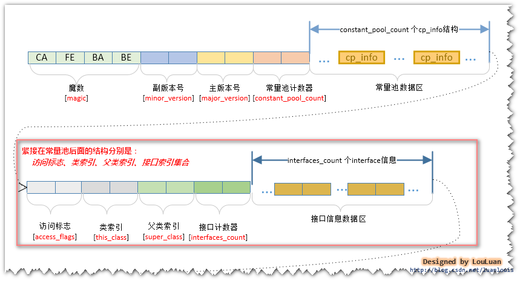
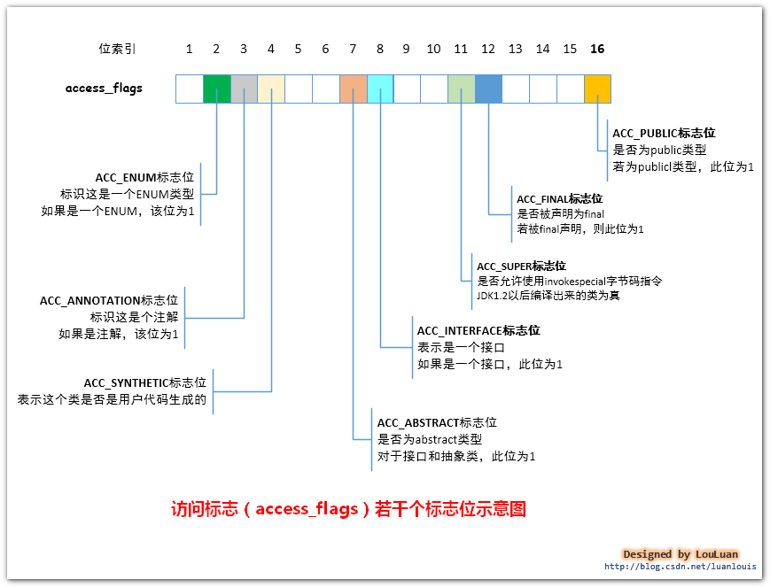
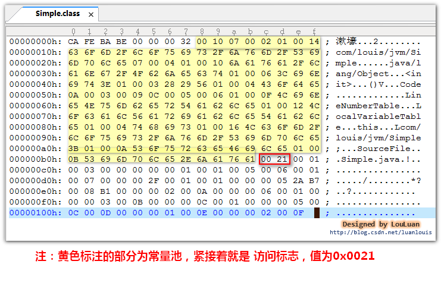
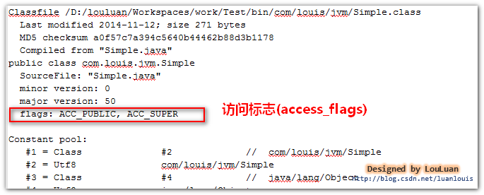
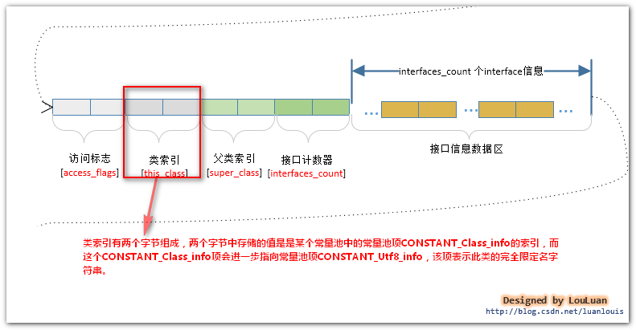
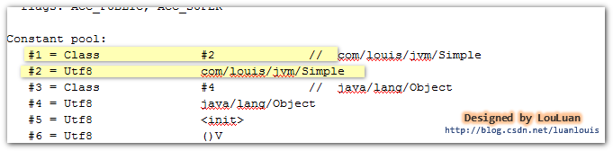
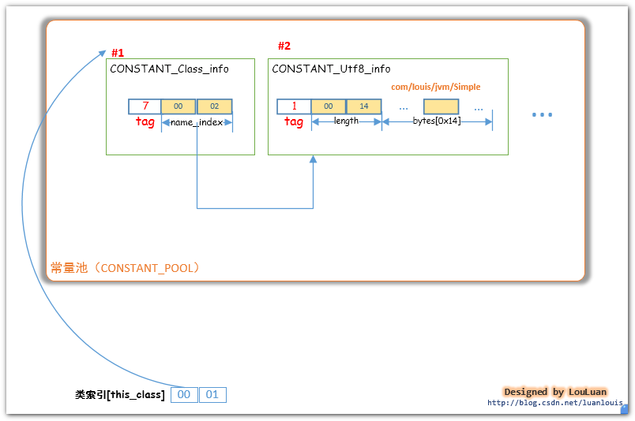
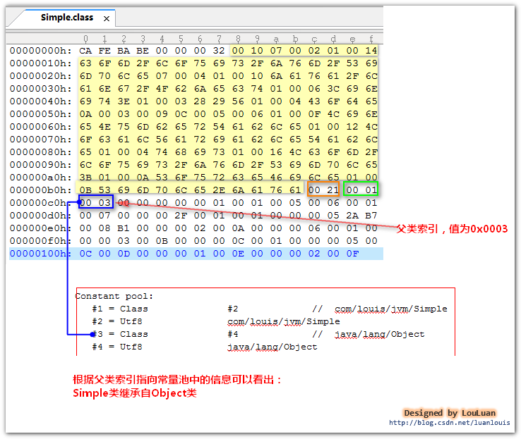
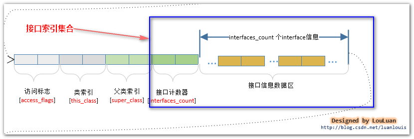
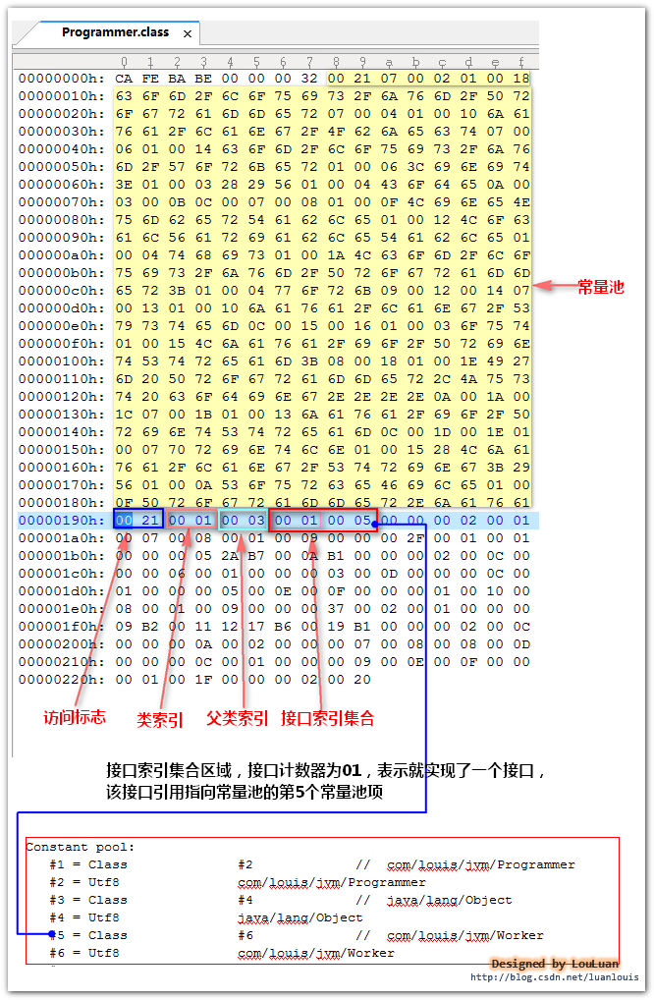

> 我们来看一下class文件中紧接着常量池后面的几个东西：访问标志、类索引、父类索引、接口索引集合。

## 1. 访问标志、类索引、父类索引、接口索引集合 在class文件中的位置



好，让我们来一一击破它们，看看它们到底是什么东西。

## 2. 访问标志(access_flags)能够表示什么？

访问标志（access_flags）紧接着常量池后，占有两个字节，总共16位，如下图所示：



当JVM在编译某个类或者接口的源代码时，JVM会解析出这个类或者接口的访问标志信息，然后，将这些标志设置到访问标志（access_flags）这16个位上。JVM会考虑如下设置如下访问表示信息：

### a. 我们知道，每个定义的类或者接口都会生成class文件（这里也包括内部类，在某个类中定义的静态内部类也会单独生成一个class文件）。
- 对于定义的类，JVM在将其编译成class文件时，会将class文件的访问标志的第11位设置为1 。第11位叫做ACC_SUPER标志位；
-对于定义的接口，JVM在将其编译成class文件时，会将class文件的访问标志的第8位 设置为 1 。第8位叫做ACC_INTERFACE标志位；

###  b. class文件表示的类或者接口的访问权限有public类型的和包package类型的。

- 如果类或者接口被声明为public类型的，那么，JVM将其编译成class文件时，会将class文件的访问标志的第16位设置为1 。第16位叫做ACC_PUBLIC标志符；

### c. 类是否为抽象类型的，即我们定义的类有没有被abstract关键字修饰，即我们定义的类是否为抽象类。

如果我们形如：
```java
public  abstract  class MyClass{......} 
```
定义某个类时，JVM将它编译成class文件的时候，会将class文件的访问标志的第7位设置为1 。第7位叫做ACC_ABSTRACT标志位。 另外值得注意的是，对于定义的接口，JVM在编译接口的时候也会对class文件的访问标志上的ACC_ABSTRACT标志位设置为 1；
### d. 该类是否被声明了final类型,即表示该类不能被继承。
- 此时JVM会在编译class文件的过程中，会将class文件的访问标志的第12位设置为 1 。第12位叫做ACC_FINAL标志位；

### e.如果我们这个class文件不是JVM通过java源代码文件编译而成的，而是用户自己通过class文件的组织规则生成的，那么，一般会对class文件的访问标志第4位设置为 1 。通过JVM编译源代码产生的class文件此标志位为 0，第4位叫做ACC_SYNTHETIC标志位；

### f. 枚举类，对于定义的枚举类如：public enum EnumTest{....}，JVM也会对此枚举类编译成class文件，这时，对于这样的class文件，JVM会对访问标志第2位设置为 1 ，以表示它是枚举类。第2位叫做ACC_ENUM标志位；

### g. 注解类，对于定义的注解类如：public @interface{.....},JVM会对此注解类编译成class文件，对于这样的class文件，JVM会将访问标志第3位设置为1，以表示这是个注解类，第3位叫做ACC_ANNOTATION标志位。

当JVM确定了上述标志位的值后，就可以确定访问标志（access_flags）的值了。实际上JVM上述标志会根据上述确定的标志位的值，对这些标志位的值取或，便得到了访问标志（access_flags）。如下图所示:


举例：定义一个最简单的类Simple.java，使用编译器编译成class文件，然后观察class文件中的访问标志的值，以及使用javap -v Simple 查看访问标志。
```java
package com.louis.jvm;

public class Simple {

}
```
使用UltraEdit查看编译成的class文件，如下图所示：



上述的图中黄色部分表示的是常量池部分，具体为什么是常量池部分不是本文的重点，有兴趣的读者可以参考我的《Java虚拟机原理图解》系列关于常量池的博客，你就可以很轻松地识别常量它们了。

常量池后面紧跟着就是访问标志，它的十六进制值为0x0021,二进制的值为：00000000 00100001，由二进制的1的位数可以得出第11、16位为1，分别对应ACC_SUPER标志位和ACC_PUBLIC标志位。

也可以通过一下运算：

          0x0021 = 0x0001 | 0x0020,  即：   访问标志表示的标志是ACC_PUBLIC + ACC_SUPER

为了验证我们的运算，使用javap -v Simple查看反编译信息如下：（小技巧：使用javap -v Simple指令的结果展示在命令提示符下显示不友好，一般我是使用javap -v Simple > temp.txt，将结果重定向到文件中，然后查看文件）





## 3. 类索引(this_class)是什么？

我们知道一般情况下一个Java类源文件经过JVM编译会生成一个class文件，也有可能一个Java类源文件中定义了其他类或者内部类，这样编译出来的class文件就不止一个，但每一个class文件表示某一个类，至于这个class表示哪一个类，便可以通过 类索引 这个数据项来确定。JVM通过类的完全限定名确定是某一个类。
​      类索引的作用，就是为了指出class文件所描述的这个类叫什么名字。

类索引紧接着访问标志的后面，占有两个字节，在这两个字节中存储的值是一个指向常量池的一个索引，该索引指向的是CONSTANT_Class_info常量池项，



以上面定义的Simple.class 为例，如下图所示，查看他的类索引在什么位置和取什么值。



由上可知，它的类索引值为0x0001,那么，它指向了常量池中的第一个常量池项，那我们再看一下常量池中的信息。使用javap -v Simple,常量池中有以下信息：



可以看到常量池中的第一项是CONSTANT_Class_info项，它表示一个"com/louis/jvm/Simple"的类名。即类索引是告诉我们这个class文件所表示的是哪一个类。


## 3. 父类索引(super_class)是什么？

Java支持单继承模式，除了java.lang.Object 类除外，每一个类都会有且只有一个父类。class文件中紧接着类索引(this_class)之后的两个字节区域表示父类索引，跟类索引一样，父类索引这两个字节中的值指向了常量池中的某个常量池项CONSTANT_Class_info，表示该class表示的类是继承自哪一个类。




## 4. 接口索引集合(interfaces)是什么？

一个类可以不实现任何接口，也可以实现很多个接口，为了表示当前类实现的接口信息，class文件使用了如下结构体描述某个类的接口实现信息:



由于类实现的接口数目不确定，所以接口索引集合的描述的前部分叫做接口计数器（interfaces_count），接口计数器占用两个字节，其中的值表示着这个类实现了多少个接口，紧跟着接口计数器的部分就是接口索引部分了，每一个接口索引占有两个字节，接口计数器的值代表着后面跟着的接口索引的个数。接口索引和类索引和父类索引一样，其内的值存储的是指向了常量池中的常量池项的索引，表示着这个接口的完全限定名。


举例：

      定义一个Worker接口，然后类Programmer实现这个Worker接口，然后我们观察Programmer的接口索引集合是怎样表示的。


```java
/**
 * Worker 接口类
 * @author luan louis
    */
    public interface Worker{

    public void work();

}
package com.louis.jvm;

public class Programmer implements Worker {

	@Override
	public void work() {
		System.out.println("I'm Programmer,Just coding....");
	}
}
```





作者的话
​    本文是《Java虚拟机原理图解》系列的其中一篇，如果您有兴趣，请关注该系列的其他文章～

   觉得本文不错，顺手点个赞哦～～您的鼓励，是我继续分享知识的强大动力！

---------------------
作者：亦山 
来源：CSDN 
原文：https://blog.csdn.net/luanlouis/article/details/41039269 
版权声明：本文为博主原创文章，转载请附上博文链接！