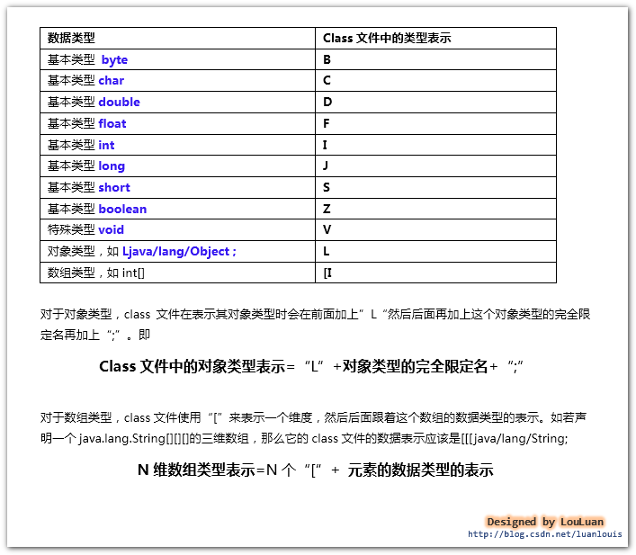
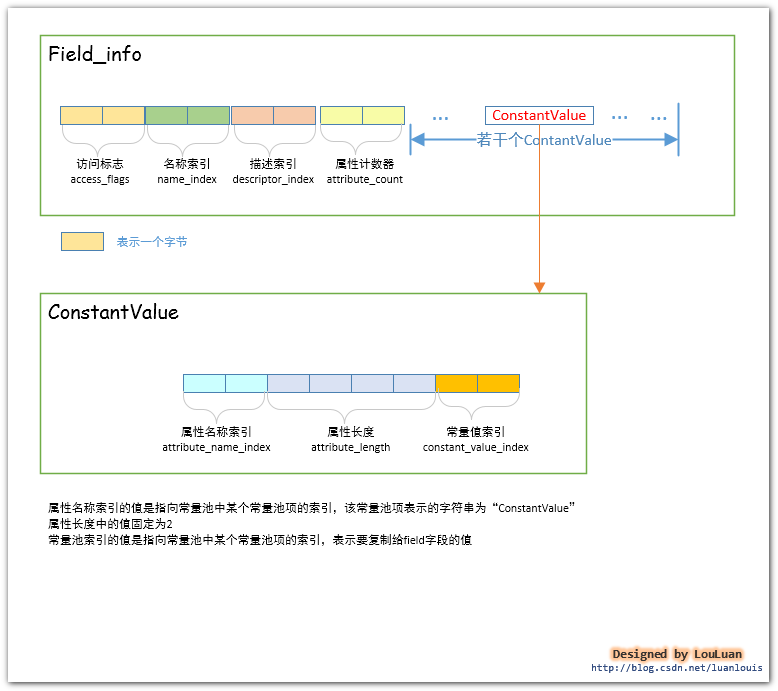

## 0.前言

了解JVM虚拟机原理是每一个Java程序员修炼的必经之路。但是由于JVM虚拟机中有很多的东西讲述的比较宽泛，在当前接触到的关于JVM虚拟机原理的教程或者博客中，绝大部分都是充斥的文字性的描述，很难给人以形象化的认知，看完之后感觉还是稀里糊涂的。

感于以上的种种，我打算把我在学习JVM虚拟机的过程中学到的东西，结合自己的理解，总结成《Java虚拟机原理图解》 这个系列，以图解的形式，将抽象的JVM虚拟机的知识具体化，希望能够对想了解Java虚拟机原理的的Java程序员 提供点帮助。


```note
读完本文，你将会学到：
1、类中定义的field字段是如何在class文件中组织的

2、不同的数据类型在class文件中是如何表示的

3、static final类型的field字段的初始化赋值问题
```

## 1.概述

字段表集合是指由若干个字段表（field_info）组成的集合。对于在类中定义的若干个字段，经过JVM编译成class文件后，会将相应的字段信息组织到一个叫做字段表集合的结构中，字段表集合是一个类数组结构，如下图所示：


注意：这里所讲的字段是指在类中定义的静态或者非静态的变量，而不是在类中的方法内定义的变量。请注意区别。

比如，如果某个类中定义了5个字段，那么，JVM在编译此类的时候，会生成5个字段表（field_info）信息,然后将字段表集合中的字段计数器的值设置成5，将5个字段表信息依次放置到字段计数器的后面。

## 2. 字段表集合在class文件中的位置

字段表集合紧跟在class文件的接口索引集合结构的后面，如下图所示：


## 3. Java中的一个Field字段应该包含那些信息？------字段表field_info结构体的定义    

针对上述的字段表示，JVM虚拟机规范规定了field_info结构体来描述字段，其表示信息如下：


下面我将一一讲解FIeld_info的组成元素：访问标志（access_flags）、名称索引（name_index）、描述索引（descriptor_index）、属性表集合

## 4. field字段的访问标志
 如上图所示定义的field_info结构体，field字段的访问标志(access_flags)占有两个字节，它能够表述的信息如下所示：


举例：如果我们在某个类中有定义field域：private static String str;，那么在访问标志上，第15位ACC_PRIVATE和第13位ACC_STATIC标志位都应该为1。field域str的访问标志信息应该是如下所示：


如上图所示，str字段的访问标志的值为0x000A，它由两个修饰符ACC_PRIVATE和ACC_STATIC组成。

根据给定的访问标志（access_flags），我们可以通过以下运算来得到这个域有哪些修饰符：


上面列举的str字段的访问标志的值为000A，那么分别域上述的标志符的特征值取&，结果为1的只有ACC_PRIVATE和ACC_STATIC，所以该字段的标志符只有有ACC_PRIVATE和ACC_STATIC。


## 5. 字段的数据类型表示和字段名称表示
class文件对数据类型的表示如下图所示：



field字段名称，我们定义了一个形如private static String str的field字段，其中"str"就是这个字段的名称。

class文件将字段名称和field字段的数据类型表示作为字符串存储在常量池中。在field_info结构体中，紧接着访问标志的，就是字段名称索引和字段描述符索引，它们分别占有两个字节，其内部存储的是指向了常量池中的某个常量池项的索引，对应的常量池项中存储的字符串，分别表示该字段的名称和字段描述符。

## 6.属性表集合-----静态field字段的初始化
在定义field字段的过程中，我们有时候会很自然地对field字段直接赋值，如下所示：

```java
	public static final int MAX=100;
	public  int count=0;
```
对于虚拟机而言，上述的两个field字段赋值的时机是不同的：
​       对于非静态（即无static修饰）的field字段的赋值将会出现在实例构造方法<init>()中
​       对于静态的field字段，有两个选择：
- 1、在静态构造方法<cinit>()中进行；
- 2 、使用ConstantValue属性进行赋值

Sun javac编译器对于静态field字段的初始化赋值策略
目前的Sun javac编译器的选择是：如果使用final和static同时修饰一个field字段，并且这个字段是基本类型或者String类型的，那么编译器在编译这个字段的时候，会在对应的field_info结构体中增加一个ConstantValue类型的结构体，在赋值的时候使用这个ConstantValue进行赋值；如果该field字段并没有被final修饰，或者不是基本类型或者String类型，那么将在类构造方法<cinit>()中赋值。

对于上述的public static final init MAX=100;   javac编译器在编译此field字段构建field_info结构体时，除了访问标志、名称索引、描述符索引外，会增加一个ConstantValue类型的属性表。



## 7.实例解析：
定义如下一个简单的Simple类，然后通过查看Simple.class文件内容并结合javap -v Simple 生成的常量池内容，分析str field字段的结构：
```java
package com.louis.jvm;

public class Simple {

	private  transient static final String str ="This is a test";
}
```


注：
```note
1. 字段计数器中的值为0x0001,表示这个类就定义了一个field字段
2. 字段的访问标志是0x009A,二进制是00000000 10011010，即第9、12、13、15位标志位为1，这个字段的标志符有：ACC_TRANSIENT、ACC_FINAL、ACC_STATIC、ACC_PRIVATE;

3. 名称索引中的值为0x0005,指向了常量池中的第5项，为“str”,表明这个field字段的名称是str；

4. 描述索引中的值为0x0006,指向了常量池中的第6项，为"Ljava/lang/String;"，表明这个field字段的数据类型是java.lang.String类型；

5.属性表计数器中的值为0x0001,表明field_info还有一个属性表；

6.属性表名称索引中的值为0x0007,指向常量池中的第7项，为“ConstantValue”,表明这个属性表的名称是ConstantValue，即属性表的类型是ConstantValue类型的；

7.属性长度中的值为0x0002，因为此属性表是ConstantValue类型，它的值固定为2；

8.常量值索引 中的值为0x0008,指向了常量池中的第8项，为CONSTANT_String_info类型的项，表示“This is a test” 的常量。在对此field赋值时，会使用此常量对field赋值。
```


## 8.您还需要了解什么

简单地说，对于一个类而言，它有两部分组成：field字段和 method方法。本文主要介绍了field字段，那还剩些一个method方法method方法啦。method方法可是说是class文件中最为重要的一部分了，它包含了方法的实现代码，即机器指令，机器指令是整个class文件的核心，如果你想了解method方法和其内的机器指令 是如何在class文件中组织的，请看下文：


《Java虚拟机原理图解》1.5、 class文件中的方法表集合--method方法在class文件中是怎样组织的
--------------------- 
作者：亦山 
来源：CSDN 
原文：https://blog.csdn.net/luanlouis/article/details/41046443 
版权声明：本文为博主原创文章，转载请附上博文链接！