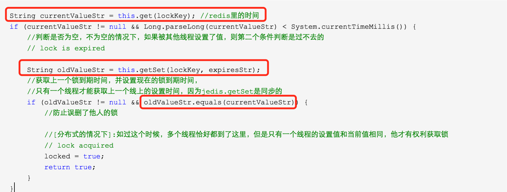

# 锁   MissionLee ： 此文不可用，可参考

## 一、使用分布式锁要满足的几个条件：

系统是一个分布式系统（关键是分布式，单机的可以使用ReentrantLock或者synchronized代码块来实现）
共享资源（各个系统访问同一个资源，资源的载体可能是传统关系型数据库或者NoSQL）
同步访问（即有很多个进程同事访问同一个共享资源。没有同步访问，谁管你资源竞争不竞争）
## 二、应用的场景例子

　　管理后台的部署架构（多台tomcat服务器+redis【多台tomcat服务器访问一台redis】+mysql【多台tomcat服务器访问一台服务器上的mysql】）就满足使用分布式锁的条件。多台服务器要访问redis全局缓存的资源，如果不使用分布式锁就会出现问题。 看如下伪代码：

```java
long N=0L;
//N从redis获取值
if(N<5){
N++；
//N写回redis
}
```
上面的代码主要实现的功能：

　　从redis获取值N，对数值N进行边界检查，自加1，然后N写回redis中。 这种应用场景很常见，像秒杀，全局递增ID、IP访问限制等。以IP访问限制来说，恶意攻击者可能发起无限次访问，并发量比较大，分布式环境下对N的边界检查就不可靠，因为从redis读的N可能已经是脏数据。传统的加锁的做法（如java的synchronized和Lock）也没用，因为这是分布式环境，这个同步问题的救火队员也束手无策。在这危急存亡之秋，分布式锁终于有用武之地了。

　　分布式锁可以基于很多种方式实现，比如zookeeper、redis...。不管哪种方式，他的基本原理是不变的：用一个状态值表示锁，对锁的占用和释放通过状态值来标识。

 　　这里主要讲如何用redis实现分布式锁。

## 三、使用redis的setNX命令实现分布式锁　　

- 1、实现的原理

　　Redis为单进程单线程模式，采用队列模式将并发访问变成串行访问，且多客户端对Redis的连接并不存在竞争关系。redis的SETNX命令可以方便的实现分布式锁。

- 2、基本命令解析
```
1）setNX（SET if Not eXists）

语法：

SETNX key value
将 key 的值设为 value ，当且仅当 key 不存在。

若给定的 key 已经存在，则 SETNX 不做任何动作。

SETNX 是『SET if Not eXists』(如果不存在，则 SET)的简写

返回值：

　　设置成功，返回 1 。
　　设置失败，返回 0 。
 例子：

复制代码
redis> EXISTS job                # job 不存在
(integer) 0

redis> SETNX job "programmer"    # job 设置成功
(integer) 1

redis> SETNX job "code-farmer"   # 尝试覆盖 job ，失败
(integer) 0

redis> GET job                   # 没有被覆盖
"programmer"
复制代码
 所以我们使用执行下面的命令

SETNX lock.foo <current Unix time + lock timeout + 1> 
如返回1，则该客户端获得锁，把lock.foo的键值设置为时间值表示该键已被锁定，该客户端最后可以通过DEL lock.foo来释放该锁。

如返回0，表明该锁已被其他客户端取得，这时我们可以先返回或进行重试等对方完成或等待锁超时。

2）getSET

语法：

GETSET key value
　　将给定 key 的值设为 value ，并返回 key 的旧值(old value)。

　　当 key 存在但不是字符串类型时，返回一个错误。

返回值：

　　返回给定 key 的旧值。
　　当 key 没有旧值时，也即是， key 不存在时，返回 nil 。
3）get
语法：
GET key
 返回值：

　　当 key 不存在时，返回 nil ，否则，返回 key 的值。
　　如果 key 不是字符串类型，那么返回一个错误
```
## 四、解决死锁

　　上面的锁定逻辑有一个问题：如果一个持有锁的客户端失败或崩溃了不能释放锁，该怎么解决？

我们可以通过锁的键对应的时间戳来判断这种情况是否发生了，如果当前的时间已经大于lock.foo的值，说明该锁已失效，可以被重新使用。 
　　发生这种情况时，可不能简单的通过DEL来删除锁，然后再SETNX一次（讲道理，删除锁的操作应该是锁拥有这执行的，这里只需要等它超时即可），当多个客户端检测到锁超时后都会尝试去释放它，这里就可能出现一个竞态条件,让我们模拟一下这个场景： 
```
复制代码
C0操作超时了，但它还持有着锁，C1和C2读取lock.foo检查时间戳，先后发现超时了。 
C1 发送DEL lock.foo 
C1 发送SETNX lock.foo 并且成功了。 
C2 发送DEL lock.foo 
C2 发送SETNX lock.foo 并且成功了。 
这样一来，C1，C2都拿到了锁！问题大了！ 
复制代码
```
　　幸好这种问题是可以避免的，让我们来看看C3这个客户端是怎样做的： 
```
复制代码
C3发送SETNX lock.foo 想要获得锁，由于C0还持有锁，所以Redis返回给C3一个0 
C3发送GET lock.foo 以检查锁是否超时了，如果没超时，则等待或重试。 
反之，如果已超时，C3通过下面的操作来尝试获得锁： 
GETSET lock.foo <current Unix time + lock timeout + 1> 
通过GETSET，C3拿到的时间戳如果仍然是超时的，那就说明，C3如愿以偿拿到锁了。 
如果在C3之前，有个叫C4的客户端比C3快一步执行了上面的操作，那么C3拿到的时间戳是个未超时的值，这时，C3没有如期获得锁，需要再次等待或重试。留意一下，尽管C3没拿到锁，但它改写了C4设置的锁的超时值，不过这一点非常微小的误差带来的影响可以忽略不计。 
复制代码
　　注意：为了让分布式锁的算法更稳键些，持有锁的客户端在解锁之前应该再检查一次自己的锁是否已经超时，再去做DEL操作，因为可能客户端因为某个耗时的操作而挂起，操作完的时候锁因为超时已经被别人获得，这时就不必解锁了。  
```
## 五、代码实现

　　expireMsecs 锁持有超时，防止线程在入锁以后，无限的执行下去，让锁无法释放 
　　timeoutMsecs 锁等待超时，防止线程饥饿，永远没有入锁执行代码的机会 

注意：项目里面需要先搭建好redis的相关配置

```java
import org.slf4j.Logger;
import org.slf4j.LoggerFactory;
import org.springframework.dao.DataAccessException;
import org.springframework.data.redis.connection.RedisConnection;
import org.springframework.data.redis.core.RedisCallback;
import org.springframework.data.redis.core.RedisTemplate;
import org.springframework.data.redis.serializer.StringRedisSerializer;

/**
 * Redis distributed lock implementation.
 *
 * @author zhengcanrui
 */
public class RedisLock {

    private static Logger logger = LoggerFactory.getLogger(RedisLock.class);

    private RedisTemplate redisTemplate;

    private static final int DEFAULT_ACQUIRY_RESOLUTION_MILLIS = 100;

    /**
     * Lock key path.
     */
    private String lockKey;

    /**
     * 锁超时时间，防止线程在入锁以后，无限的执行等待
     */
    private int expireMsecs = 60 * 1000;

    /**
     * 锁等待时间，防止线程饥饿
     */
    private int timeoutMsecs = 10 * 1000;

    private volatile boolean locked = false;

    /**
     * Detailed constructor with default acquire timeout 10000 msecs and lock expiration of 60000 msecs.
     *
     * @param lockKey lock key (ex. account:1, ...)
     */
    public RedisLock(RedisTemplate redisTemplate, String lockKey) {
        this.redisTemplate = redisTemplate;
        this.lockKey = lockKey + "_lock";
    }

    /**
     * Detailed constructor with default lock expiration of 60000 msecs.
     *
     */
    public RedisLock(RedisTemplate redisTemplate, String lockKey, int timeoutMsecs) {
        this(redisTemplate, lockKey);
        this.timeoutMsecs = timeoutMsecs;
    }

    /**
     * Detailed constructor.
     *
     */
    public RedisLock(RedisTemplate redisTemplate, String lockKey, int timeoutMsecs, int expireMsecs) {
        this(redisTemplate, lockKey, timeoutMsecs);
        this.expireMsecs = expireMsecs;
    }

    /**
     * @return lock key
     */
    public String getLockKey() {
        return lockKey;
    }

    private String get(final String key) {
        Object obj = null;
        try {
            obj = redisTemplate.execute(new RedisCallback<Object>() {
                @Override
                public Object doInRedis(RedisConnection connection) throws DataAccessException {
                    StringRedisSerializer serializer = new StringRedisSerializer();
                    byte[] data = connection.get(serializer.serialize(key));
                    connection.close();
                    if (data == null) {
                        return null;
                    }
                    return serializer.deserialize(data);
                }
            });
        } catch (Exception e) {
            logger.error("get redis error, key : {}", key);
        }
        return obj != null ? obj.toString() : null;
    }

    private boolean setNX(final String key, final String value) {
        Object obj = null;
        try {
            obj = redisTemplate.execute(new RedisCallback<Object>() {
                @Override
                public Object doInRedis(RedisConnection connection) throws DataAccessException {
                    StringRedisSerializer serializer = new StringRedisSerializer();
                    Boolean success = connection.setNX(serializer.serialize(key), serializer.serialize(value));
                    connection.close();
                    return success;
                }
            });
        } catch (Exception e) {
            logger.error("setNX redis error, key : {}", key);
        }
        return obj != null ? (Boolean) obj : false;
    }

    private String getSet(final String key, final String value) {
        Object obj = null;
        try {
            obj = redisTemplate.execute(new RedisCallback<Object>() {
                @Override
                public Object doInRedis(RedisConnection connection) throws DataAccessException {
                    StringRedisSerializer serializer = new StringRedisSerializer();
                    byte[] ret = connection.getSet(serializer.serialize(key), serializer.serialize(value));
                    connection.close();
                    return serializer.deserialize(ret);
                }
            });
        } catch (Exception e) {
            logger.error("setNX redis error, key : {}", key);
        }
        return obj != null ? (String) obj : null;
    }

    /**
     * 获得 lock.
     * 实现思路: 主要是使用了redis 的setnx命令,缓存了锁.
     * reids缓存的key是锁的key,所有的共享, value是锁的到期时间(注意:这里把过期时间放在value了,没有时间上设置其超时时间)
     * 执行过程:
     * 1.通过setnx尝试设置某个key的值,成功(当前没有这个锁)则返回,成功获得锁
     * 2.锁已经存在则获取锁的到期时间,和当前时间比较,超时的话,则设置新的值
     *
     * @return true if lock is acquired, false acquire timeouted
     * @throws InterruptedException in case of thread interruption
     */
    public synchronized boolean lock() throws InterruptedException {
        int timeout = timeoutMsecs;
        while (timeout >= 0) {
            long expires = System.currentTimeMillis() + expireMsecs + 1;
            String expiresStr = String.valueOf(expires); //锁到期时间
            if (this.setNX(lockKey, expiresStr)) {
                // lock acquired
                locked = true;
                return true;
            }

            String currentValueStr = this.get(lockKey); //redis里的时间
            if (currentValueStr != null && Long.parseLong(currentValueStr) < System.currentTimeMillis()) {
                //判断是否为空，不为空的情况下，如果被其他线程设置了值，则第二个条件判断是过不去的
                // lock is expired

                String oldValueStr = this.getSet(lockKey, expiresStr);
                //获取上一个锁到期时间，并设置现在的锁到期时间，
                //只有一个线程才能获取上一个线上的设置时间，因为jedis.getSet是同步的
                if (oldValueStr != null && oldValueStr.equals(currentValueStr)) {
                    //防止误删（覆盖，因为key是相同的）了他人的锁——这里达不到效果，这里值会被覆盖，但是因为什么相差了很少的时间，所以可以接受

                    //[分布式的情况下]:如过这个时候，多个线程恰好都到了这里，但是只有一个线程的设置值和当前值相同，他才有权利获取锁
                    // lock acquired
                    locked = true;
                    return true;
                }
            }
            timeout -= DEFAULT_ACQUIRY_RESOLUTION_MILLIS;

            /*
                延迟100 毫秒,  这里使用随机时间可能会好一点,可以防止饥饿进程的出现,即,当同时到达多个进程,
                只会有一个进程获得锁,其他的都用同样的频率进行尝试,后面有来了一些进行,也以同样的频率申请锁,这将可能导致前面来的锁得不到满足.
                使用随机的等待时间可以一定程度上保证公平性
             */
            Thread.sleep(DEFAULT_ACQUIRY_RESOLUTION_MILLIS);

        }
        return false;
    }


    /**
     * Acqurired lock release.
     */
    public synchronized void unlock() {
        if (locked) {
            redisTemplate.delete(lockKey);
            locked = false;
        }
    }

}
```
复制代码
 调用：


复制代码
 RedisLock lock = new RedisLock(redisTemplate, key, 10000, 20000);
 try {
            if(lock.lock()) {
                   //需要加锁的代码
                }
            }
        } catch (InterruptedException e) {
            e.printStackTrace();
        }finally {
            //为了让分布式锁的算法更稳键些，持有锁的客户端在解锁之前应该再检查一次自己的锁是否已经超时，再去做DEL操作，因为可能客户端因为某个耗时的操作而挂起，
            //操作完的时候锁因为超时已经被别人获得，这时就不必解锁了。 ————这里没有做
            lock.unlock();
        }
复制代码
六、一些问题

1、为什么不直接使用expire设置超时时间，而将时间的毫秒数其作为value放在redis中？

如下面的方式，把超时的交给redis处理：

lock(key, expireSec){
isSuccess = setnx key
if (isSuccess)
expire key expireSec
}
　　这种方式貌似没什么问题，但是假如在setnx后，redis崩溃了，expire就没有执行，结果就是死锁了。锁永远不会超时。

 2、为什么前面的锁已经超时了，还要用getSet去设置新的时间戳的时间获取旧的值，然后和外面的判断超时时间的时间戳比较呢？



　　因为是分布式的环境下，可以在前一个锁失效的时候，有两个进程进入到锁超时的判断。如：

C0超时了，还持有锁,C1/C2同时请求进入了方法里面

C1/C2获取到了C0的超时时间

C1使用getSet方法

C2也执行了getSet方法

假如我们不加 oldValueStr.equals(currentValueStr) 的判断，将会C1/C2都将获得锁，加了之后，能保证C1和C2只能一个能获得锁，一个只能继续等待。

注意：这里可能导致超时时间不是其原本的超时时间，C1的超时时间可能被C2覆盖了，但是他们相差的毫秒及其小，这里忽略了。

 

致谢：感谢您的阅读！转载请加原文链接，谢谢。转载请加上原文链接，谢谢！http://www.cnblogs.com/0201zcr/p/5942748.html