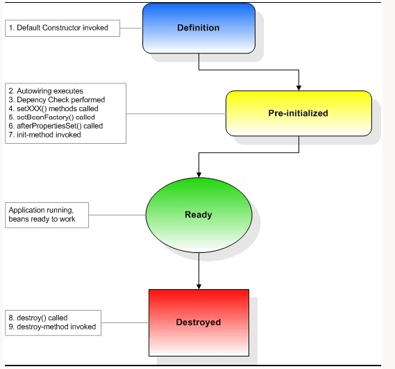

# Spring中Bean的生命周期

## Spring 中bean 的生命周期短暂吗?

在spring中，从BeanFactory或ApplicationContext取得的实例为Singleton，也就是`预设为每一个Bean的别名只能维持一个实例`，而不是每次都产生一个新的对象使用Singleton模式产生单一实例，对单线程的程序说并不会有什么问题，但对于多线程的程序，就必须注意安全`(Thread-safe)`的议题，防止多个线程同时存取共享资源所引发的数据不同步问题。

然而在spring中 可以设定每次从BeanFactory或ApplicationContext指定别名并取得Bean时都产生一个新的实例：

>在spring中，singleton属性默认是true，只有设定为false，则每次指定别名取得的Bean时都会产生一个新的实例

## 一个Bean从创建到销毁，如果是用BeanFactory来生成,管理Bean的话，会经历几个执行阶段(如图)：


- 1：Bean的建立：

容器寻找Bean的定义信息并将其实例化。

- 2：属性注入：

使用依赖注入，Spring按照Bean定义信息配置Bean所有属性

- 3：BeanNameAware的setBeanName()：

如果Bean类有实现org.springframework.beans.BeanNameAware接口，工厂调用Bean的setBeanName()方法传递Bean的ID。

- 4：BeanFactoryAware的setBeanFactory()：

如果Bean类有实现org.springframework.beans.factory.BeanFactoryAware接口，工厂调用setBeanFactory()方法传入工厂自身。

- 5：BeanPostProcessors的ProcessBeforeInitialization()

如果有org.springframework.beans.factory.config.BeanPostProcessors和Bean关联，那么其postProcessBeforeInitialization()方法将被将被调用。

- 6：initializingBean的afterPropertiesSet()：

如果Bean类已实现org.springframework.beans.factory.InitializingBean接口，则执行他的afterProPertiesSet()方法

- 7：Bean定义文件中定义init-method：

可以在Bean定义文件中使用"init-method"属性设定方法名称例如：

 

如果有以上设置的话，则执行到这个阶段，就会执行initBean()方法

- 8：BeanPostProcessors的ProcessaAfterInitialization()

如果有任何的BeanPostProcessors实例与Bean实例关联，则执行BeanPostProcessors实例的ProcessaAfterInitialization()方法

>此时，Bean已经可以被应用系统使用，并且将保留在BeanFactory中知道它不在被使用。有两种方法可以将其从BeanFactory中删除掉(如图):


- 1：DisposableBean的destroy()

在容器关闭时，如果Bean类有实现org.springframework.beans.factory.DisposableBean接口，则执行他的destroy()方法

- 2：Bean定义文件中定义destroy-method

在容器关闭时，可以在Bean定义文件中使用"destroy-method"属性设定方法名称，例如：

 

>如果有以上设定的话，则进行至这个阶段时，就会执行destroy()方法，如果是使用ApplicationContext来生成并管理Bean的话则稍有不同，使用ApplicationContext来生成及管理Bean实例的话，在执行BeanFactoryAware的setBeanFactory()阶段后，若Bean类上有实现org.springframework.context.ApplicationContextAware接口，则执行其setApplicationContext()方法，接着才执行BeanPostProcessors的ProcessBeforeInitialization()及之后的流程。

------------

找工作的时候有些人会被问道Spring中Bean的生命周期，其实也就是考察一下对Spring是否熟悉，工作中很少用到其中的内容，那我们简单看一下。

    在说明前可以思考一下Servlet的生命周期：实例化，初始init，接收请求service，销毁destroy；

    Spring上下文中的Bean也类似，如下

    1、实例化一个Bean－－也就是我们常说的new；

    2、按照Spring上下文对实例化的Bean进行配置－－也就是IOC注入；

    3、如果这个Bean已经实现了BeanNameAware接口，会调用它实现的setBeanName(String)方法，此处传递的就是Spring配置文件中Bean的id值

    4、如果这个Bean已经实现了BeanFactoryAware接口，会调用它实现的setBeanFactory(setBeanFactory(BeanFactory)传递的是Spring工厂自身（可以用这个方式来获取其它Bean，只需在Spring配置文件中配置一个普通的Bean就可以）；

    5、如果这个Bean已经实现了ApplicationContextAware接口，会调用setApplicationContext(ApplicationContext)方法，传入Spring上下文（同样这个方式也可以实现步骤4的内容，但比4更好，因为ApplicationContext是BeanFactory的子接口，有更多的实现方法）；

    6、如果这个Bean关联了BeanPostProcessor接口，将会调用postProcessBeforeInitialization(Object obj, String s)方法，BeanPostProcessor经常被用作是Bean内容的更改，并且由于这个是在Bean初始化结束时调用那个的方法，也可以被应用于内存或缓存技术；

    7、如果Bean在Spring配置文件中配置了init-method属性会自动调用其配置的初始化方法。

    8、如果这个Bean关联了BeanPostProcessor接口，将会调用postProcessAfterInitialization(Object obj, String s)方法、；

    注：以上工作完成以后就可以应用这个Bean了，那这个Bean是一个Singleton的，所以一般情况下我们调用同一个id的Bean会是在内容地址相同的实例，当然在Spring配置文件中也可以配置非Singleton，这里我们不做赘述。

    9、当Bean不再需要时，会经过清理阶段，如果Bean实现了DisposableBean这个接口，会调用那个其实现的destroy()方法；

    10、最后，如果这个Bean的Spring配置中配置了destroy-method属性，会自动调用其配置的销毁方法。

 

以上10步骤可以作为面试或者笔试的模板，另外我们这里描述的是应用Spring上下文Bean的生命周期，如果应用Spring的工厂也就是BeanFactory的话去掉第5步就Ok了。

 

 

 

  这Spring框架中，一旦把一个bean纳入到Spring IoC容器之中，这个bean的生命周期就会交由容器进行管理，一般担当管理者角色的是BeanFactory或ApplicationContext。认识一下Bean的生命周期活动，对更好的利用它有很大的帮助。
    下面以BeanFactory为例，说明一个Bean的生命周期活动：
Bean的建立
      由BeanFactory读取Bean定义文件，并生成各个实例。

Setter注入
      执行Bean的属性依赖注入。

BeanNameAware的setBeanName()
      如果Bean类实现了org.springframework.beans.factory.BeanNameAware接口，则执行其setBeanName()方法。

BeanFactoryAware的setBeanFactory()
      如果Bean类实现了org.springframework.beans.factory.BeanFactoryAware接口，则执行其setBeanFactory()方法。

BeanPostProcessors的processBeforeInitialization()
      容器中如果有实现org.springframework.beans.factory.BeanPostProcessors接口的实例，则任何Bean在初始化之前都会执行这个实例的processBeforeInitialization()方法。

InitializingBean的afterPropertiesSet()
      如果Bean类实现了org.springframework.beans.factory.InitializingBean接口，则执行其afterPropertiesSet()方法。

Bean定义文件中定义init-method
      在Bean定义文件中使用“init-method”属性设定方法名称，如下：
```xml
<bean id="demoBean" class="com.yangsq.bean.DemoBean" init-method="initMethod">
  .......
 </bean>
```
      这时会执行initMethod()方法，注意，这个方法是不带参数的。

BeanPostProcessors的processAfterInitialization()
      容器中如果有实现org.springframework.beans.factory.BeanPostProcessors接口的实例，则任何Bean在初始化之前都会执行这个实例的processAfterInitialization()方法。

DisposableBean的destroy()
      在容器关闭时，如果Bean类实现了org.springframework.beans.factory.DisposableBean接口，则执行它的destroy()方法。

Bean定义文件中定义destroy-method
      在容器关闭时，可以在Bean定义文件中使用“destory-method”定义的方法
```xml
<bean id="demoBean" class="com.yangsq.bean.DemoBean" destory-method="destroyMethod">
  .......
</bean>
```
       这时会执行destroyMethod()方法，注意，这个方法是不带参数的。

   以上就是BeanFactory维护的一个Bean的生命周期。下面这个图可能更直观一些：

